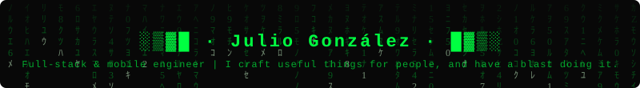

<p align="center"></p>

---

## 🧠 Currently exploring

- ****[Production Monorepos](https://vercel.com/academy/production-monorepos)**** — Vercel Academy course on structuring and scaling monorepos in production

- ****Learning [KMP](https://kotlinlang.org/docs/multiplatform/)**** — Kotlin Multiplatform for sharing code across Android, iOS, and other targets

- ****Contributing to [Open Food Facts](https://github.com/openfoodfacts/smooth-app)**** - open-source Flutter & Dart mobile app for Android and iOS

- ****Angular**** - create and deploy webapps and PWA

- ****AI-assisted development & agent architecture**** - local LLMs via Ollama, Claude Code, custom agents, memory, context, reasoning and tool use, integrated into real products

- ****Google I/O 2026**** - Compose-first Android (Jetpack Compose v1.11), Flutter 3.44 with generative UI, Android 17 Adaptive Everywhere (phone · car · XR), native app generation from prompts in AI Studio, and Gemini 3.5 Flash optimised for mobile agentic tasks

- ****WWDC 2026**** - iOS 27 & macOS Golden Gate, rebuilt Siri AI with cross-app context and standalone app, SwiftUI next-gen (less code · better performance · new toolbar & document APIs), Xcode 27 with on-device AI code completion, and App Intents as the new mandatory Siri integration surface (SiriKit deprecated)

---

## 📱 Mobile

| Platform               | Stack                    |
| ---------------------- | ------------------------ |
| ****Cross-platform**** | Flutter · Dart           |
| ****iOS****            | SwiftUI · Swift          |
| ****Android****        | Jetpack Compose · Kotlin |

---

## 🌐 Backend & Web

  
```

Next.js · TypeScript · Spring Boot · Python · Angular

```


REST APIs, event-driven architectures, third-party service integration.

---

## ☁️ Cloud & Infra


```

AWS · Firebase · Azure · Docker

```


---

## 🤖 AI & LLMs

My current focus is turning AI capabilities into real user value:

- ****Local LLMs**** - Ollama on Apple Silicon (M5 Pro, 48 GB RAM); quantized models, benchmarking, prompt engineering

- ****Claude Code**** - agentic coding; enriched-context sessions (SOUL.md, project documentation)

- ****Agent design**** - identity, voice, consistent behavior; beyond the generic chatbot

- ****AI in own products**** - integration in Flutter/iOS/Android apps; intelligent coaching, generative feedback

- ****RAG & embeddings**** - semantic retrieval over domain knowledge bases

- ****Prompt engineering**** - robust system prompts, few-shot, chain-of-thought, structured output

---

## 🏗️ Domains I've worked in


- 💊 ****Health & pharmacy**** - Platforms for healthcare professionals

- 🎓 ****E-Learning**** - eLearning platform and content provider for serving companies, training centers, and public administration

- 🎾 ****Sports**** - Learning Academy for Padel coaches and players

- 🧴 ****Health coaching**** - tracking apps with personalised feedback 

- 👥 ****HR & staffing**** - ERP for personnel and contract management

- 📄 ****Document management**** - digitisation and approval workflows

- 🚛 ****Logistics**** - fleet routing and route optimisation
  

---

